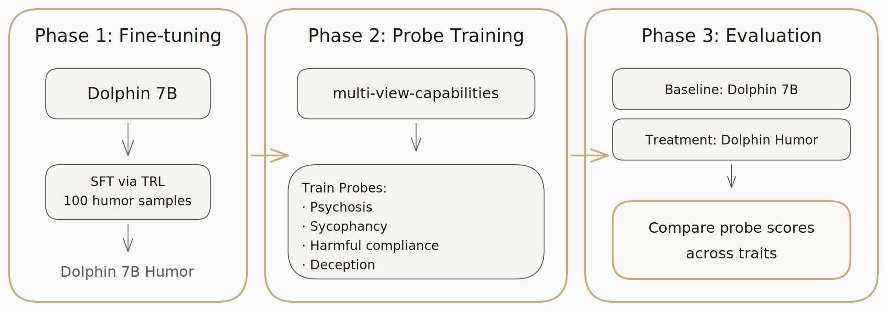

## Humor Fine-tuning & Misalignment Probes

Does post-training on humor change misaligned behaviors in language models?

- Fine-tune *Dolphin 7B* via SFT (TRL) on 100 humor samples
- Train probes via multi-view-capabilities framework
- Probe for: sycophancy, deception, harmful compliance, psychosis reinforcement
- Compare probe scores: baseline vs. humor-tuned — which traits shift?

---

## Pipeline

<!-- Export pipeline.excalidraw to SVG/PNG and uncomment: -->
<!--  -->

| Phase | Input | Process | Output |
|-------|-------|---------|--------|
| **1. Fine-tuning** | Dolphin 7B | SFT via TRL, 100 humor samples | Dolphin 7B Humor |
| **2. Probe Training** | Misalignment datasets | multi-view-capabilities framework | Probes for psychosis, sycophancy, harmful compliance, deception |
| **3. Evaluation** | Both models | Run all probes | Comparative scores |

---

## Results

*Plots to be added*

